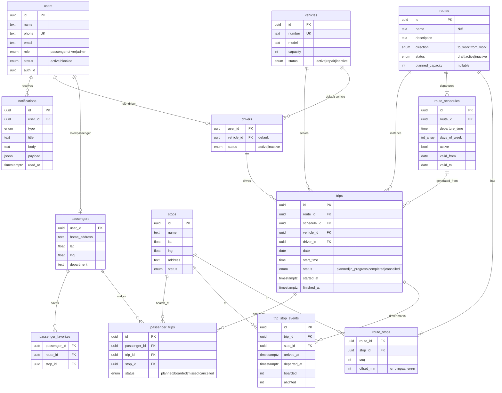

# Корпоративный транспорт — анализ требований и проектное решение

Статус: **ЭТАП 3 РЕАЛИЗОВАН** (2026-09-21): прогноз спроса и рекомендации по маршрутам. Решения заказчика — раздел 11, ход работ — разделы 12, 14 и 15.
Дата: 2026-09-21
Источник: исходное ТЗ (16 разделов)

---

## 1. Резюме

Нужна единая система корпоративного транспорта, а не справочник маршрутов.
Ядро системы — **цепочка данных**:

```
Пассажир → PassengerTrip (намерение/факт поездки)
Водитель → TripStopEvent (факт прибытия на остановку, число севших)
         ↓
Trip (рейс) → Route (маршрут) → RouteStop/Stop
         ↓
Analytics (загрузка по рейсам / остановкам / времени / дням)
         ↓
Администратор → сигнал о перегрузке → решение (маршрут, транспорт, рейс)
```

Главное открытие анализа: **исходная модель данных не позволяет посчитать загрузку**,
потому что в ней нет источника факта «сколько людей поехало» и нет сущности
«расписание» (у маршрута много отправлений, а `RouteStop.planned_arrival_time` — одно
время). Это два ключевых конфликта (CONFLICT #3, #4), без их решения аналитика
невозможна. Ниже предложены решения.

---

## 2. Проблема, цель, границы

### Проблема
Сотрудники не знают, какой корпоративный транспорт им подходит, где остановка и когда
приедет. Администрация не видит фактическую загрузку и принимает решения о маршрутах
вслепую.

### Desired Outcome
1. Пассажир за 1 экран получает ответ: **куда идти → какой транспорт → когда приедет**.
2. Водитель за 1 экран видит: **какой маршрут → текущая остановка → следующая → через сколько**.
3. Администратор видит **загрузку каждого маршрута по факту** и получает сигналы
   «перегрузка / недозагрузка» с разбивкой по времени и остановкам.
4. Все данные связаны: поездка пассажира и отметки водителя формируют статистику.

### Scope (Этап 1 — MVP)
См. раздел 9.

### Out of scope на Этапе 1
GPS-трекинг транспорта, push-уведомления, прогнозирование спроса, автоматические
рекомендации маршрутов, нативные мобильные приложения, интеграция с HR-системой.

### Ограничения (приняты как допущения, см. раздел 11)
- Одна компания (single-tenant).
- Язык интерфейса — русский.
- Один пользователь = одна роль.
- Система **не принимает** решения об изменении маршрутов автоматически — только показывает данные и рекомендации.

### Definition of Done для MVP
- Админ создаёт остановки, маршрут с порядком остановок и расписанием, транспорт, водителя; назначает рейсы на день.
- Пассажир открывает приложение, даёт геолокацию (или используется домашний адрес) и видит ближайшую остановку, ближайший рейс и время до прибытия по расписанию. Видит маршрут на карте и расписание. Отмечает «поеду» на конкретном рейсе.
- Водитель видит рейсы на сегодня, запускает рейс, отмечает «прибыл на остановку» и число севших; пассажир видит уточнённое время прибытия по отметкам водителя.
- Админ видит дашборд: число маршрутов/транспорта/водителей/пассажиров, загрузку по маршрутам (%, средняя, максимальная), статус 🟢/🟡/🔴, разбивку по времени, остановкам и дням недели.
- Тесты домена (ближайшая остановка, ETA, расчёт загрузки, статусы) проходят; сборка проходит; сид-данные позволяют сразу увидеть работу всех трёх ролей.

---

## 3. Роли и основные сценарии

### 3.1 Пассажир
| # | Сценарий | Приоритет |
|---|----------|-----------|
| P1 | Открыл приложение → вижу ближайшую остановку, ближайший рейс, время до прибытия | MVP |
| P2 | Смотрю список маршрутов (утро / вечер), выбираю маршрут → карта + остановки + расписание | MVP |
| P3 | Выбираю рейс (07:30) → вижу время прибытия на каждую остановку | MVP |
| P4 | Отмечаю «поеду этим рейсом с остановки X» (бронь/намерение) | MVP |
| P5 | Сохраняю маршрут/остановку в избранное; главный экран учитывает избранное | MVP |
| P6 | Вижу уведомления об изменении маршрута/расписания/задержке (внутри приложения) | MVP (in-app), push — этап 2 |
| P7 | Вижу транспорт на карте в реальном времени | Этап 2 (GPS) |
| P8 | Получаю push «транспорт через 5 минут» | Этап 2 |

### 3.2 Водитель
| # | Сценарий | Приоритет |
|---|----------|-----------|
| D1 | Вижу свои рейсы на сегодня (маршрут, отправление, транспорт) | MVP |
| D2 | Запускаю рейс → «режим движения»: текущая / следующая остановка / через N мин | MVP |
| D3 | Нажимаю «Прибыл» на остановке, указываю число севших (и вышедших) | MVP |
| D4 | Вижу ожидаемых пассажиров по остановкам (из броней P4) | MVP |
| D5 | Завершаю рейс | MVP |
| D6 | Получаю уведомление об изменении маршрута / сообщение админа | MVP (in-app) |
| D7 | Телефон передаёт GPS-позицию автоматически | Этап 2 |

### 3.3 Администратор
| # | Сценарий | Приоритет |
|---|----------|-----------|
| A1 | CRUD остановок (на карте), маршрутов (порядок остановок, смещения времени), расписаний, транспорта, водителей, пассажиров | MVP |
| A2 | Формирую рейсы на день/период из расписания, назначаю транспорт и водителя | MVP |
| A3 | Дашборд: общая статистика + маршруты с перегрузкой / недозагрузкой | MVP |
| A4 | Аналитика маршрута: загрузка по рейсам, по времени, по остановкам, по дням недели | MVP |
| A5 | Отправляю сообщение водителю/пассажирам маршрута (in-app) | MVP |
| A6 | Вижу карту: все маршруты, остановки, загрузка | MVP (без живых позиций) |
| A7 | Получаю рекомендации: «маршрут №5 перегружен в 07:30 на остановках X, Y — добавить рейс» | Базовая версия сигналов — MVP; полноценные рекомендации — этап 2 |
| A8 | Вижу отклонение транспорта от маршрута / отсутствие транспорта | Этап 2 (GPS) |

---

## 4. Архитектура

### 4.1 Компоненты (по ТЗ, раздел 14)

```
┌─────────────────┐  ┌─────────────────┐  ┌─────────────────┐
│  Passenger App  │  │   Driver App    │  │ Admin Dashboard │
│  (mobile-first) │  │  (mobile-first) │  │ (desktop-first) │
└────────┬────────┘  └────────┬────────┘  └────────┬────────┘
         └────────────────────┼────────────────────┘
                              ▼
                   ┌─────────────────────┐
                   │     Backend API     │  auth, бизнес-логика, аналитика
                   │  + Real-time layer  │  (этап 2: позиции, уведомления)
                   └──────────┬──────────┘
                              ▼
                   ┌─────────────────────┐
                   │   PostgreSQL        │  единая база данных
                   └─────────────────────┘
```

### 4.2 Вариант A (рекомендуется): TypeScript-монорепо, Next.js + PostgreSQL (Supabase)

```
transport1/
├── apps/
│   └── web/                 Next.js (App Router), один деплой
│       ├── app/(passenger)/ /app       — PWA, mobile-first
│       ├── app/(driver)/    /driver    — PWA, mobile-first
│       ├── app/(admin)/     /admin     — desktop-first
│       └── app/api/v1/      REST API (для будущих нативных приложений)
├── packages/
│   ├── domain/              чистая бизнес-логика, без фреймворков, unit-тесты:
│   │                        nearestStops(), eta(), tripLoad(), routeLoadStatus(),
│   │                        recommendations()
│   ├── db/                  схема (Drizzle ORM), миграции, seed
│   └── ui/                  общие компоненты (карта, карточки, статусы)
└── docs/
```

| Слой | Технология | Почему |
|------|-----------|--------|
| БД | PostgreSQL (Supabase) | Реляционная модель с большим числом связей; аналитика = SQL-представления; Supabase уже подключён к сессии |
| Auth | Supabase Auth | Готовые сессии, RLS; роль хранится в `users.role` |
| API | Next.js Route Handlers + zod | Один контракт для web и будущих мобильных клиентов |
| Real-time (этап 2) | Supabase Realtime | Позиции транспорта и уведомления без отдельного WS-сервера |
| Карта | Leaflet + OpenStreetMap | Без ключей и оплаты; провайдер тайлов заменяем (Яндекс/2GIS) |
| Мобильные | PWA (установка на экран, геолокация, позже web-push) | Быстрее всего проверить на телефоне; нативные Expo-приложения позже переиспользуют `packages/domain` и REST API |
| Хостинг | Vercel | HTTPS обязателен для геолокации и PWA; коннектор уже есть |
| Тесты | Vitest (domain), Playwright (ключевые сценарии) | |

Ключевое архитектурное правило: **бизнес-логика живёт в `packages/domain` и не зависит
от Next.js/Supabase**. Это гарантирует, что при переходе на отдельный backend (вариант B)
или нативные приложения логику не придётся переписывать.

### 4.3 Вариант B: NestJS API + React SPA + PostgreSQL (Docker) + Socket.IO

Классическое разделение frontend/backend, отдельные деплои. Плюсы: строгие границы,
привычно для команды бэкенд-разработчиков. Минусы: в 1.5–2 раза больше кода и
инфраструктуры до первого рабочего MVP, две точки деплоя, свой WS-сервер и своя auth.

### 4.4 Рекомендация
**Вариант A.** Для MVP критична скорость получения рабочей системы, которую можно
открыть на телефоне. Вариант A даёт это при одном деплое и сохраняет путь миграции
к варианту B за счёт изолированного домена и REST-контракта.

---

## 5. Модель данных

### 5.1 ERD (предлагаемая, с изменениями относительно ТЗ)



### 5.2 Отличия от структуры в ТЗ и почему

| В ТЗ | Предложение | Причина |
|------|-------------|---------|
| `Route.capacity` | Убрать; вместимость рейса = `Vehicle.capacity` назначенного транспорта. Оставить опциональное `planned_capacity` для маршрутов без транспорта | Два источника одного числа неизбежно разойдутся (CONFLICT #1) |
| `RouteStop.planned_arrival_time` (одно время) | `RouteStop.offset_min` (смещение от отправления) + новая сущность `route_schedules` (список отправлений 06:30, 07:00…) | У маршрута много отправлений; время на остановке = отправление + смещение (CONFLICT #4) |
| `Passenger.preferred_routes / preferred_stops` (массивы) | Таблица `passenger_favorites` | Нормальная связь, можно считать популярность остановок |
| нет | `trip_stop_events` | Единственный источник факта «сколько село» без GPS; одновременно даёт полу-realtime ETA (CONFLICT #3, #5) |
| нет | `notifications` | Требуется разделом 9 ТЗ |
| нет | `route_change_log` | Этап 2: история изменений маршрута для уведомлений и корректной аналитики |
| нет | `vehicle_positions` | Этап 2: GPS |
| `Analytics` как сущность | SQL-представления `v_trip_load`, `v_route_load_daily` + материализация при росте данных | Считать из фактов, а не хранить дубли |

### 5.3 Ключевые расчёты (packages/domain)

**Загрузка рейса**
```
demand(trip)        = count(passenger_trips where status in (planned, boarded))
onboard_after(k)    = Σ boarded[1..k] − Σ alighted[1..k]
max_onboard(trip)   = max_k onboard_after(k)
load_pct(trip)      = max(demand, max_onboard) / vehicle.capacity × 100
```
`demand` может превышать вместимость (34 при 30) — это и есть сигнал «сотрудники не
могут попасть на маршрут».

**Статус маршрута** (окно 14 дней, пороги настраиваемые):
- 🔴 Перегрузка — доля рейсов с `load_pct ≥ 100` ≥ 30% **или** средняя ≥ 95%
- 🟡 Низкая загрузка — средняя `load_pct` < 40%
- 🟢 Нормальная — иначе

**ETA для пассажира на остановке k (MVP, без GPS)**
```
если рейс не начат:   eta = date + departure_time + offset_k
если рейс идёт и водитель отметил остановку j < k:
                      eta = arrived_at_j + (offset_k − offset_j)
если k уже пройдена:  показать следующий рейс
```

**Ближайшая остановка**: гаверсинус от позиции пассажира (геолокация → иначе домашний
адрес) до активных остановок, отфильтрованных по активным маршрутам нужного
направления (утро → `to_work`, вечер → `from_work`).

---

## 6. Структура экранов

### Пассажир (mobile-first, `/app`)
1. **Главная** — карточка: ближайшая остановка (название, расстояние) → ближайший рейс (маршрут, ETA) → кнопка «Поеду». Ниже: избранное, следующие 2–3 рейса.
2. **Маршруты** — список, переключатель Утро/Вечер, статус (изменён/задержка).
3. **Маршрут** — карта (линия, остановки, моя позиция), список остановок, расписание отправлений.
4. **Рейс** — отправление 07:30, остановки с временем, кнопка «Поеду с остановки…».
5. **Остановка** — какие маршруты проходят, ближайшие прибытия.
6. **Уведомления** — список.
7. **Профиль** — домашний адрес (для fallback), избранное.

### Водитель (mobile-first, `/driver`)
1. **Сегодня** — список рейсов (время, маршрут, транспорт), кнопка «Начать».
2. **Рейс в движении** — крупно: текущая остановка / следующая / через N мин / ожидают N чел. Кнопки: «Прибыл», «+сели / −вышли», «Завершить». Минимум элементов.
3. **Остановки рейса** — весь список с плановым временем и ожидаемыми пассажирами.
4. **Уведомления** — сообщения админа, изменения маршрута.

### Администратор (desktop-first, `/admin`)
1. **Дашборд** — KPI (маршруты, транспорт, водители, пассажиры, активные, средняя/макс загрузка), списки 🔴/🟡, лента сигналов.
2. **Маршруты** — таблица; редактор: карта, порядок остановок (drag), смещения, расписание, направление, статус.
3. **Остановки** — карта + таблица.
4. **Транспорт**, **Водители**, **Пассажиры** — таблицы + формы.
5. **Рейсы** — день/неделя: генерация из расписания, назначение транспорта и водителя, статусы.
6. **Аналитика** — по маршруту: загрузка по рейсам (время), по остановкам, по дням недели; сравнение маршрутов.
7. **Рекомендации** — сигналы с данными (когда, где, сколько) и предложениями; действия делает админ вручную.
8. **Уведомления** — отправка сообщений водителям/пассажирам маршрута.

---

## 7. User flow

### Пассажир (главный сценарий)
```
Открыть → запрос геолокации
  ├─ разрешено → ближайшие остановки по координатам
  └─ отказ    → остановки по домашнему адресу (или выбрать вручную)
→ Главная: 📍 «Центр», 350 м · 🚌 №5 · через 7 мин
→ [тап] Маршрут №5: карта + остановки + расписание
→ [тап на 07:30] Рейс: остановки с временем
→ [Поеду с «Центр»] → passenger_trips(planned)
→ (водитель в пути) ETA уточняется по отметкам водителя
→ (после рейса) поездка в истории; водитель отметил число севших → аналитика
```

### Водитель
```
Войти → Сегодня: 07:30 №5 (Газель 01A123)
→ [Начать] → trip.in_progress
→ Экран движения: Текущая «Центр» → Следующая «Мкр 12» → через 4 мин · ждут 6
→ [Прибыл] → trip_stop_events(arrived_at)
→ [+6 сели] → boarded=6 → [Отправился]
→ … последняя остановка → [Завершить] → trip.completed
```

### Администратор
```
Дашборд → 🔴 Маршрут №5: 112% (7 из 10 рейсов ≥100%)
→ Аналитика №5: пик 07:30, остановки «Центр», «Мкр 12»; спрос 34 при 30 местах
→ Решение (вручную): добавить рейс 07:15 / назначить транспорт на 45 мест / новый маршрут
→ Изменение расписания → уведомление пассажирам и водителю
```

---

## 8. Реальное время без GPS (важное проектное решение)

ТЗ выносит GPS и realtime на этап 2, но главный экран пассажира требует «через 7 минут».
Предлагается в MVP два уровня точности:

1. **По расписанию** — всегда доступно.
2. **По отметкам водителя** — как только водитель нажал «Прибыл» на остановке, ETA для
   следующих остановок пересчитывается. Обновление на клиенте — опрос раз в 15–30 сек
   (этап 2: Supabase Realtime без изменения модели).

Это даёт пассажиру полезный ETA уже в MVP, а администратору — факт времени прохождения
остановок (задержки, отклонения от расписания) без GPS-оборудования.

---

## 9. MVP — границы

### Входит
**Общее**: auth по ролям, seed-данные (1 город, 3–4 маршрута, 15–20 остановок, 3 транспорта, 3 водителя, 30 пассажиров, 2 недели истории рейсов и поездок для аналитики).

**Пассажир**: главная (ближайшая остановка → рейс → ETA), список маршрутов утро/вечер, карта маршрута, остановки, расписание, экран рейса, «Поеду», избранное, in-app уведомления.

**Водитель**: рейсы на сегодня, режим движения, отметки «Прибыл / сели / вышли / Завершить», ожидаемые пассажиры, in-app уведомления.

**Администратор**: CRUD остановок/маршрутов/расписаний/транспорта/водителей/пассажиров, генерация и назначение рейсов, дашборд, аналитика загрузки (по рейсам, времени, остановкам, дням недели), статусы 🟢🟡🔴, базовые сигналы перегрузки/недозагрузки, отправка сообщений.

### Не входит (этап 2+)
GPS-позиции и транспорт на карте в реальном времени; push-уведомления; web-sockets (в MVP — опрос); прогноз спроса; автоматические предложения новых маршрутов по адресам сотрудников; версионирование маршрутов; нативные приложения; импорт сотрудников из HR; мультиязычность; несколько компаний.

---

## 10. Конфликты и неоднозначности

### CONFLICT #1 — двойная вместимость
- **В ТЗ**: `Route.capacity` и `Vehicle.capacity`.
- **Конфликт**: на маршрут №5 назначили Газель (18) вместо автобуса (30) — какой знаменатель у процента загрузки?
- **A**: хранить обе, считать по `Route.capacity` — просто, но проценты врут при подмене транспорта.
- **B (рекомендация)**: считать по транспорту рейса; `Route.planned_capacity` — только для планирования, когда транспорт ещё не назначен.
- **Решение**: подтвердить B.

### CONFLICT #2 — маршрут и направление (утро/вечер)
- **В ТЗ**: `Route.direction`, при этом «Маршрут №3: Утро 06:30… Вечер 17:30…» — один маршрут.
- **Конфликт**: утренний и вечерний рейсы идут в разные стороны с разным порядком остановок и разными смещениями. Один `Route` не может описать оба.
- **A (рекомендация)**: `Route` = одно направление; утро и вечер — две записи с одинаковым `name` («№3») и разным `direction`. UI группирует по имени.
- **B**: один `Route` с флагом «вечером в обратном порядке» и двумя наборами смещений — сложнее, ломается на несимметричных маршрутах.
- **Решение**: подтвердить A.

### CONFLICT #3 — откуда берутся факты о пассажирах (ключевой)
- **В ТЗ**: «Пассажир использует маршрут → система фиксирует поездку → статистика». Как именно фиксирует — не сказано. `PassengerTrip` есть, но кто его создаёт?
- **Варианты источника**:
  - **A** Пассажир сам отмечает «поеду» (бронь/намерение). Плюс: даёт спрос, в т. ч. выше вместимости; видно, кто не попал. Минус: нужна дисциплина сотрудников.
  - **B** Водитель на каждой остановке вводит число севших. Плюс: факт, дисциплина одного человека. Минус: не видно, кто именно и кто не попал.
  - **C** Автоматически по GPS-близости телефона (этап 2, неточно).
  - **D (рекомендация)** = A + B: спрос от пассажиров, факт от водителя; загрузка = max(спрос, факт). Аналитика различает «спрос» и «факт».
- **Решение**: подтвердить D и ответить: обязательна ли отметка «поеду» для пассажира, или это опционально (тогда факт водителя — основной источник)?

### CONFLICT #4 — расписание отсутствует в модели
- **В ТЗ**: `RouteStop.planned_arrival_time` — одно время, но маршрут имеет 5 утренних и 5 вечерних отправлений.
- **Решение (предлагается без альтернатив, т. к. иначе модель не работает)**: `RouteStop.offset_min` + `route_schedules(departure_time, days_of_week)`; `Trip` создаётся из расписания на дату. Подтвердить.

### CONFLICT #5 — «через 7 минут» без GPS в MVP
- **В ТЗ**: главный экран показывает время до прибытия; GPS — этап 2.
- **Решение (рекомендация)**: раздел 8 — ETA по расписанию + уточнение по отметкам водителя. Подтвердить, что отметки водителя «Прибыл» входят в MVP (они же дают данные о задержках).

### CONFLICT #6 — пороги статусов не заданы
- 87% названо «нормальной», 34/30 — «перегрузка». Границы «низкой» не указаны.
- **Рекомендация**: 🔴 ≥100% в ≥30% рейсов за 14 дней или средняя ≥95%; 🟡 средняя <40%; пороги в настройках админа.
- **Решение**: подтвердить или задать свои значения.

### CONFLICT #7 — авторизация не описана
- В `User` есть телефон, нет пароля/email. Корпоративная система: SSO? SMS-код (платно)?
- **A (рекомендация для MVP)**: админ создаёт пользователей; вход по телефону/email + пароль, выданный админом (Supabase Auth, без SMS). Регистрации «с улицы» нет.
- **B**: вход по SMS-коду — требует SMS-провайдера и бюджета.
- **C**: корпоративный SSO (Google Workspace / Microsoft) — зависит от того, что есть в компании.
- **Решение**: выбрать.

### CONFLICT #8 — что видит водитель о пассажирах
- «Список пассажиров/ожидаемых пассажиров» — имена или только количество по остановкам?
- **Рекомендация**: количество по остановкам крупно + имена по тапу (корпоративная среда, персональные данные внутри компании).
- **Решение**: подтвердить.

### CONFLICT #9 — `Driver.vehicle_id` и `Trip.vehicle_id`
- Оба есть в ТЗ. Если водитель сегодня на другой машине — что верно?
- **Решение (рекомендация)**: `Driver.vehicle_id` — транспорт по умолчанию (подставляется при генерации рейсов), `Trip.vehicle_id` — фактический и главный для аналитики. Подтвердить.

### CONFLICT #10 — изменение маршрута и старая статистика
- Если админ поменял остановки маршрута, прошлые рейсы ссылаются на старый порядок. Загрузка «по остановкам» за прошлые дни станет некорректной.
- **Решение**: в MVP — без версионирования (изменения действуют вперёд), `trip_stop_events` хранят `stop_id`, поэтому факты по остановкам сохраняются. Версионирование — этап 2. Подтвердить, что это приемлемо для MVP.

### Неоднозначности (приняты допущения, поправьте если не так)
- Расстояние до остановки — по прямой (гаверсинус), не пешеходный маршрут.
- Утро/вечер определяются по текущему времени (до 12:00 — `to_work`), с ручным переключателем.
- Расписание задаётся по дням недели; праздники — этап 2.
- Домашний адрес пассажира вводит сам пассажир в профиле (админ может править).
- Один пользователь — одна роль; водитель, который иногда ездит пассажиром, — этап 2.
- Уведомления в MVP — только внутри приложения (список + счётчик), без push.
- Город/регион для seed-данных и карты — нужно уточнить (названия остановок в ТЗ выглядят как Центральная Азия; для OSM это не важно, для Яндекс/2GIS — важно).

---

## 11. Решения заказчика (приняты 2026-09-21)

Все пункты приняты по рекомендации. Уточнения: Supabase-проекта нет — разработка на локальном PostgreSQL (Docker); город для данных и карты — **Худжанд** (Таджикистан).

| # | Вопрос | Рекомендация |
|---|--------|--------------|
| 1 | Стек: вариант A (Next.js + Supabase + Vercel) или B (NestJS + React + Docker)? | A |
| 2 | Использовать существующий проект Supabase (подключён к сессии) или локальный PostgreSQL в Docker? | Уточнить, есть ли проект; иначе локальный Postgres, Supabase — при деплое |
| 3 | Мобильные приложения в MVP — PWA или сразу нативные (Expo)? | PWA |
| 4 | Источник фактов о поездках — D (бронь пассажира + отметки водителя)? Бронь обязательна или опциональна? | D, бронь опциональна |
| 5 | Авторизация — A (админ создаёт, вход по паролю), B (SMS), C (SSO)? | A |
| 6 | Пороги 🔴/🟡 — принять предложенные (≥100% в 30% рейсов / средняя <40%)? | Да, настраиваемые |
| 7 | Водитель видит имена пассажиров или только количество? | Количество + имена по тапу |
| 8 | Подтвердить изменения модели: без `Route.capacity`, `Route`=одно направление, `route_schedules`, `trip_stop_events` | Да |
| 9 | Город для seed-данных и карты; провайдер карты (OSM / Яндекс / 2GIS)? | OSM (Leaflet) |
| 10 | Язык только русский? | Да, строки вынести в один файл для будущего i18n |

---

## 12. План реализации MVP (после согласования)

Порядок выбран так, чтобы каждый шаг давал проверяемый результат и данные для следующего.

| Задача | Результат (DoD) |
|--------|-----------------|
| T-001 Каркас монорепо, линт, тесты, CI-скрипты | `pnpm build && pnpm test` проходят |
| T-002 Схема БД + миграции + seed | Все таблицы, seed с 2 неделями истории |
| T-003 `packages/domain`: гаверсинус, ближайшие остановки, ETA, загрузка рейса, статус маршрута — с unit-тестами | Тесты: happy path, пустые данные, границы (100%, 0 пассажиров, нет транспорта) |
| T-004 Auth + роли + защита разделов `/app`, `/driver`, `/admin` | Пользователь каждой роли попадает только в свой раздел |
| T-005 Admin: остановки (карта + CRUD) | Остановку можно создать кликом по карте |
| T-006 Admin: маршруты (порядок остановок, смещения, направление) + расписания | Маршрут №5 утро/вечер с 5 отправлениями |
| T-007 Admin: транспорт, водители, пассажиры | CRUD |
| T-008 Admin: рейсы — генерация из расписания, назначение | Рейсы на неделю созданы |
| T-009 Passenger: главная (геолокация → остановка → рейс → ETA) | Сценарий из раздела 11 ТЗ |
| T-010 Passenger: маршруты, карта, расписание, экран рейса, «Поеду», избранное | |
| T-011 Driver: сегодня, режим движения, отметки, завершение | ETA пассажира меняется после «Прибыл» |
| T-012 Admin: дашборд + аналитика (по рейсам, времени, остановкам, дням недели) + статусы | Seed показывает 🔴 на одном маршруте, 🟡 на другом |
| T-013 Уведомления in-app: изменение маршрута/расписания, сообщение админа | Водитель и пассажиры видят уведомление |
| T-014 Базовые сигналы/рекомендации для админа | «№5: перегрузка в 07:30 на остановках X, Y, спрос 34/30» |
| T-015 Финальный аудит: сборка, тесты, e2e трёх сценариев, документация | |

### Статус выполнения (2026-09-21)

Все задачи T-001 — T-015 выполнены. Проверено вручную в браузере:

- **Пассажир**: вход, геолокация с откатом на домашний адрес, ближайшая остановка с расстоянием, ближайший рейс с временем до прибытия, «Поеду», список маршрутов утро/вечер, карта маршрута, расписание, экран рейса, уведомления, профиль.
- **Водитель**: рейсы на сегодня, запуск рейса, режим движения (текущая/следующая остановка, время, ожидающие), отметка прибытия, счётчик севших и вышедших, отправление, завершение рейса.
- **Администратор**: дашборд с KPI и статусами маршрутов, сигналы с разбором пика и остановок, аналитика по времени/дням/остановкам/рейсам, справочники остановок, маршрутов, транспорта, водителей, пассажиров, генерация и назначение рейсов, рассылка уведомлений, пороги загрузки.
- **Сквозной сценарий**: сигнал «маршрут №1 перегружен, пик 07:30» → администратор добавил отправление 07:15 → расписание обновлено → 66 уведомлений пассажирам и водителям → пассажир видит уведомление в приложении.

Проверки: `pnpm test` — 39 тестов домена проходят; `pnpm typecheck`, `pnpm lint`, `pnpm build` — без ошибок.

Отличия от исходного плана: авторизация реализована на собственных сессиях в PostgreSQL
(таблица `sessions`) вместо Supabase Auth, так как проекта Supabase нет и разработка идёт
на локальной базе. Модель данных и API при переезде на Supabase не меняются.

---

## 14. Этап 2: GPS и уведомления (выполнено 2026-09-21)

### Что добавлено

**Данные.** Три таблицы: `vehicle_positions` (след рейса с отклонением от линии маршрута),
`push_subscriptions` (эндпоинты устройств), `trip_stop_alerts` (защита от повторных
уведомлений о подъезде). Настройки мониторинга хранятся в `settings` под ключом `live_settings`.

**Доменная логика** (`packages/domain/src/live.ts`, 20 тестов): проекция точки на линию
маршрута, расстояние до сегмента, время прибытия по позиции и скорости, средняя и плановая
скорость, состояние связи, определение отклонения и потери связи, окно уведомления о подъезде.

**Водитель.** Телефон передаёт координаты каждые 15 секунд, только пока рейс в пути.
Отслеживание включается кнопкой «Начать рейс» и выключается при завершении. На экране видно
состояние передачи; если геолокация запрещена, выводится предупреждение.

**Пассажир.** Транспорт виден на карте рейса, время прибытия по всем остановкам считается от
текущего положения. На главном экране отметка «по GPS». Push-уведомление о подъезде приходит
один раз на остановку и отправляется в момент, когда расчётное время входит в заданное окно.

**Администратор.** Раздел «Мониторинг»: карта всех машин в рейсе, состояние связи и сигналы
об отклонении от маршрута, отсутствии данных и не начатом рейсе. Блок «Сейчас на линии»
добавлен на дашборд. Пороги мониторинга редактируются в настройках.

**Уведомления.** Изменение маршрута, отмена рейса, сообщение администратора и подъезд
транспорта уходят одновременно в приложение и в push. Web push на ключах VAPID, сервис-воркер
`public/sw.js`. Устройство подписывается только по явному нажатию в профиле.

### Принятые решения

| Вопрос | Решение | Причина |
|--------|---------|---------|
| Транспорт реального времени | Опрос REST-эндпоинтов раз в 15 секунд | Не требует отдельного сервиса и второго деплоя; путь к websocket-каналу остаётся открытым |
| Приватность водителя | Координаты пишутся только при статусе рейса «в пути» | Сотрудник не отслеживается вне рабочего рейса |
| Расчёт по GPS | Позиция проецируется на линию маршрута, дальше считается расстояние по маршруту | Прямая линия до остановки давала бы заниженное время |
| Скорость | Показания устройства в диапазоне 8–80 км/ч, иначе плановая скорость маршрута | Стоящий автобус и выбросы GPS не должны ломать прогноз |
| Повторные уведомления | Таблица `trip_stop_alerts` с уникальным ключом рейс + остановка + пассажир | Пассажир получает сообщение о подъезде один раз |
| Экономия батареи | В фоне опрос не идёт, при возврате на вкладку данные обновляются сразу | Проверено: без этого страница в фоне не получала первую порцию данных |

### Проверено вручную

Водитель начал рейс, координаты отправлены через API: отклонение от маршрута рассчитано
(3, 88 и 2 метра), пассажиру на остановке «Панчшанбе» отправлено ровно одно уведомление
«Маршрут №1 подъезжает — через 5 мин». Пассажир увидел «через 2 мин, по данным GPS, осталось
1000 м» и время по GPS на всех последующих остановках. Администратор увидел машину на карте
со статусом «на связи»; после серии точек в стороне от маршрута появился сигнал
«Отклонение от маршрута: №1 · 17:30, транспорт в 810 м от линии маршрута».

Проверки: 59 тестов домена, `pnpm typecheck`, `pnpm lint`, `pnpm build` — без ошибок.

---

## 15. Этап 3: прогноз спроса и рекомендации (выполнено 2026-09-21)

### Что добавлено

**Прогноз спроса** (`packages/domain/src/forecast.ts`). Ожидаемое число пассажиров на каждом
запланированном рейсе ближайшей недели: средневзвешенное по сопоставимым прошлым рейсам с
периодом полураспада 14 дней. Выборка сужается от «этот рейс в этот день недели» до «весь
маршрут», и использованная группа показывается пользователю вместе с числом рейсов и разбросом.
Риск рейса: не хватит мест, возможна нехватка, норма, низкая загрузка.

**Планирование сети** (`packages/domain/src/planning.ts`). Группировка домашних адресов по
близости (жадный детерминированный алгоритм), расстояние до ближайшей остановки, выделение
неохваченных групп, предложение добавить остановку на существующую линию и черновик нового
маршрута с порядком остановок, смещениями и ожидаемым числом пассажиров.

**Раздел «Прогноз»** в админ-панели: показатели риска, таблица прогнозов по рейсам с основанием
расчёта, таблица «кто не помещается в транспорт», карта групп проживания с выделением
неохваченных, предложения с кнопками «Добавить рейс» и «Создать черновик маршрута».
Колонка «Прогноз» добавлена в раздел «Рейсы», где назначается транспорт.

**Сид-данные** дополнены 12 сотрудниками из районов без остановок (Кайраккум, Чкаловск),
чтобы рекомендации были видны на демонстрационных данных.

### Принятые решения

| Вопрос | Решение | Причина |
|--------|---------|---------|
| Метод прогноза | Средневзвешенное по истории, без ML | Администратор должен понимать, откуда взялась цифра, и видеть, на скольких рейсах она основана |
| Недостаток истории | Расширение выборки с указанием использованной группы | Честнее показать менее точный прогноз с пометкой, чем не показать ничего |
| Кластеризация | Жадная группировка по радиусу, детерминированная | Результат воспроизводим и объясним, в отличие от k-средних со случайной инициализацией |
| Новый маршрут | Черновик, не активный маршрут | Требование ТЗ: система не принимает решения самостоятельно |
| Несколько групп | Отдельный маршрут, если следующая группа дальше 8 км | Проверка показала: одно предложение на все группы давало маршрут 38 км через весь город |

### Проверено вручную

Прогноз по маршруту №1: пик 07:30, ожидается 37 человек при вместимости 30, пять рейсов
без мест, основание — «этот рейс в другие дни, 11 рейсов, точность средняя». Анализ покрытия
нашёл две неохваченные группы: 7 человек в 11 км от ближайшей остановки и 5 человек в 9,7 км.
Система предложила два отдельных маршрута (13,3 км на 36 минут и 12,6 км на 34 минуты).
Нажатие «Создать черновик маршрута» создало остановку и маршрут со статусом «черновик»,
расписанием 07:30 и корректными смещениями.

Проверки: 89 тестов домена, `pnpm typecheck`, `pnpm lint`, `pnpm build` — без ошибок.

### Замечание по окружению

Dev-сервер Next.js по умолчанию доверяет только тому имени хоста, на котором запущен. В конфиг
добавлен `allowedDevOrigins` для `localhost`, `127.0.0.1` и локальной сети — иначе страницы,
открытые по другому адресу, не гидратируются и кнопки не работают.

---

## 16. Parking lot (этап 4+)

- Push для нативных приложений (web push уже работает).
- Websocket или SSE вместо опроса, если 15 секунд окажется мало.
- Версионирование маршрутов (`route_versions`) для корректной истории.
- Импорт сотрудников из HR / SSO.
- Праздники и исключения в расписании.
- Мультиязычность, мультикомпания.
